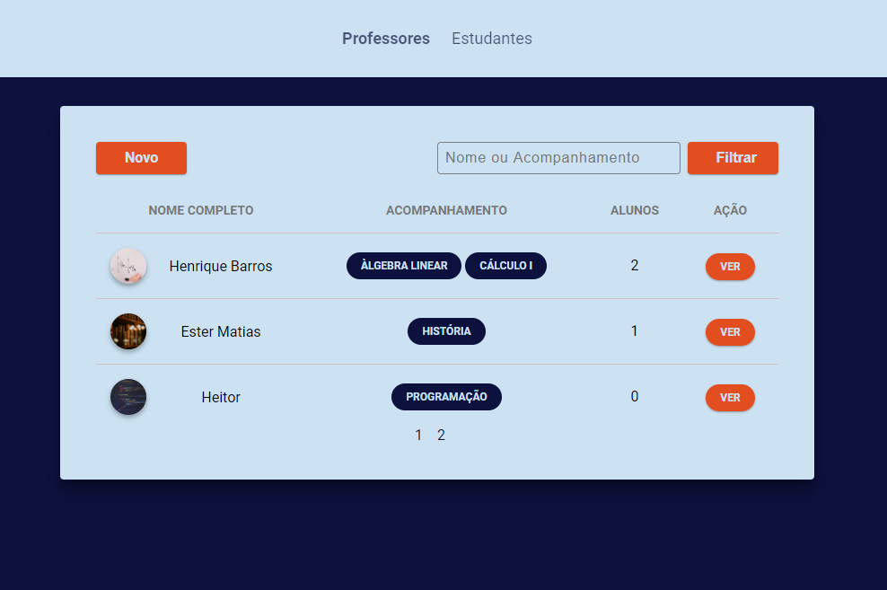

    

# My Teacher

> Aplicação idealizada para ser uma ponte entre professores e alunos.

# Tecnologias

* HTML
* CSS
* Javascript
* Node.js
* PostgreSQL
* Nunjucks
* Express.js

# Dependências

* [express](https://github.com/expressjs/express)
* [method-override](https://github.com/expressjs/method-override)
* [nunjucks](https://github.com/mozilla/nunjucks)
* [node-postgres](https://github.com/brianc/node-postgres)

# Dependências de desenvolvimento

* [Browsersync](https://github.com/BrowserSync/browser-sync)
* [Nodemon](https://github.com/remy/nodemon)
* [npm-run-all](https://github.com/mysticatea/npm-run-all)